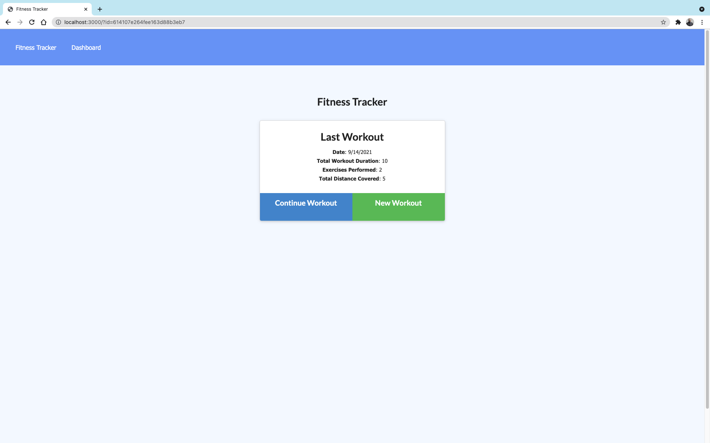
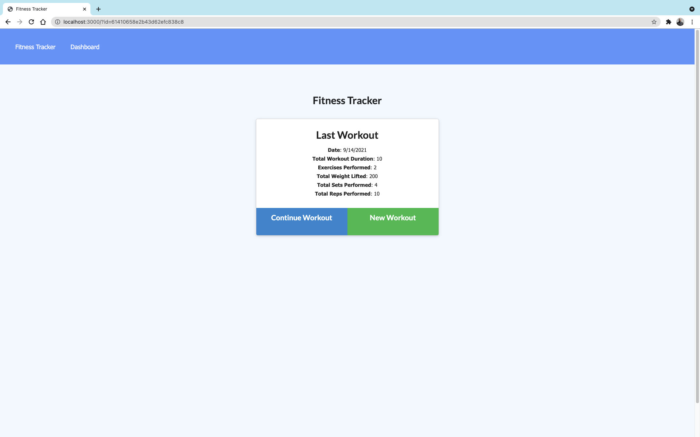
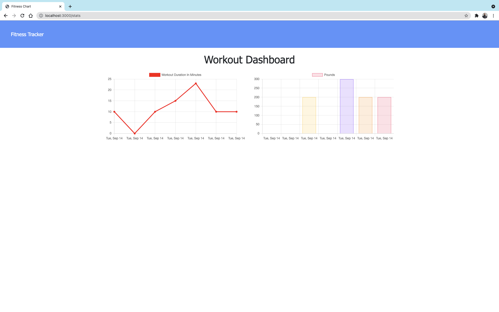
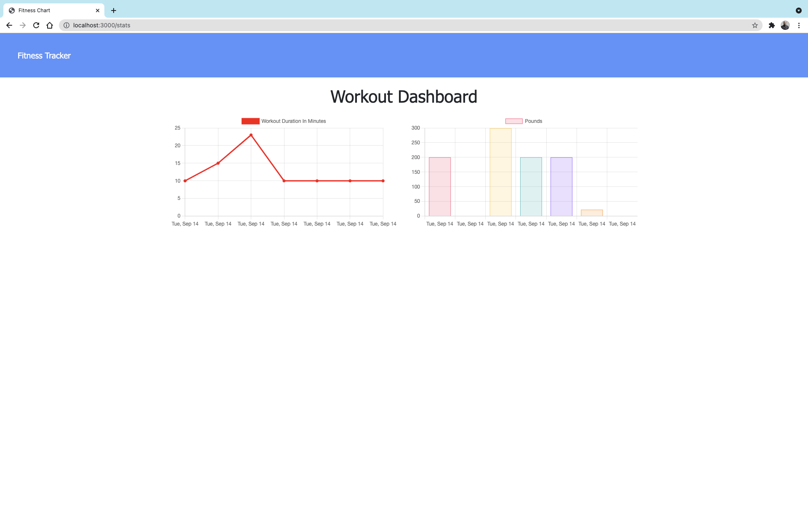

<div id="top"></div>

<!-- Badges -->
[](http://shields.io/)
[](http://shields.io/)
[](http://shields.io/)
[](http://shields.io/)
[](http://shields.io/)
[](http://shields.io/)
[](http://shields.io/)
[](http://shields.io/)
[](http://shields.io/)

# Workout-Tracker
A consumer will reach their fitness goals more quickly when they track their workout progress.
The appllication will keep track of every exercise in your workout. This application has a dashboard that will display weekly summary graphs of all workouts done in a week.

## Table of Contents
<!-- TABLE OF CONTENTS -->
<details>
  <summary><strong>Table of Contents</strong></summary>
  <ol>
    <li>
      <a href="#about-the-project">About The Project</a>
      <ul>
        <li><a href="#built-with">Built With</a></li>
      </ul>
    </li>
    <li><a href="#user-story">User Story</a></li>
    <li><a href="#link-to-live-demo">Link to Live Demo</a></li>
    <li><a href="#usage">Usage</a></li>
    <li><a href="#prerequisites">Prerequisites</a></li>
    <li><a href="#installation">Installation</a></li>
    <li><a href="#contributing">Contributing</a></li>
    <li><a href="#license">License</a></li>
    <li><a href="#contact">Contact</a></li>
    <li><a href="#acknowledgments">Acknowledgments</a></li>
  </ol>
</details>

## About The Project
This is a fitness app that will allow user to view, create, and track daily workouts. 
- The user is able to log multiple exercises in a given day.
- The user is able to update the workout. 
- The user is able to track the name, type, weight, sets, reps and duration of each exercise.

<p align="center">
   
&nbsp; &nbsp; &nbsp; &nbsp;
  
&nbsp; &nbsp; &nbsp; &nbsp;
  
  &nbsp; &nbsp; &nbsp; &nbsp;
  
</p>

## User Story
```md
As a user, I want to be able to view create and track daily workouts. I want to be able to log multiple exercises in a workout on a given day. I should also be able to track the name, type, weight, sets, reps, and duration of exercise. If the exercise is a cardio exercise, I should be able to track my distance traveled.
```
### Link to Live Demo
[Fitness - Tracker](https://workout-trackermm.herokuapp.com/)

### Prerequisites

Please make sure that you have the latest node packages.
* npm
  ```sh
  npm install npm@latest -g
  ```

## Installation
- To deploy an application with a MongoDB database to Heroku, you'll need to set up a MongoDB Atlas account and connect a database from there to your application.
- If you want to run it on your local server Download it through Github
- Run npm i or (npm install), to make sure to download all the necessary files in the jason package.
- In your command shell run npm start.
<p align="right">(<a href="#top">back to top</a>)</p>

## Usage 
Workout-Tracker provides the user with plenty of functionality to help them reach their fitness goals. Users are able to:
- Log multiple exercises in a workout
- Track the name, type, weight, sets, reps, and duration of each exercise
- Track the distance traveled if the exercise was cardio based
View past workouts
-  After installation and from bash or zsh, type `npm start` in the command line to start running the app.
* Code Snippet:
```js
// Get and update one workout 
router.put("/api/workouts/:id", ({ params, body }, res) => {
    // console.log("PARAMS", body, params);
    Workout.findOneAndUpdate(
        { _id: params.id },
        {
            $push: { exercises: body } 
        },
        { new: true }
    )
        .then((dbWorkout) => {
            res.json(dbWorkout);
        })
        .catch((err) => {
            res.json(err);
        });
});
```
This function will get an exercise to the array of exercises that belong to the workout with the given id. Here we will locate the workout with the given ID and update its fields.

### Built With

Node.js, HTML, Express, Mongoose and Mongodb.
<p align="right">(<a href="#top">back to top</a>)</p>

## Contributing

Contributions are what make the open source community such an amazing place to learn, inspire, and create. Any contributions you make are **greatly appreciated**.

If you have a suggestion that would make this better, please fork the repo and create a pull request. You can also simply open an issue with the tag "enhancement".
Don't forget to give the project a star! Thanks again!

1. Fork the Project
2. Create your Feature Branch (`git checkout -b feature/AmazingFeature`)
3. Commit your Changes (`git commit -m 'Add some AmazingFeature'`)
4. Push to the Branch (`git push origin feature/AmazingFeature`)
5. Open a Pull Request


<!-- CONTACT -->
## Contact
[](http://shields.io/)

Mohamed Mesahel - mohamed.mesahel86@gmail.com

[](http://shields.io/)

https://github.com/MohamedMesahel

[![LinkedIn][linkedin-shield]][linkedin-url] 

<!-- LICENSE -->
## License

Distributed under the MIT License. 
<!-- ACKNOWLEDGMENTS -->
## Acknowledgments

List for some useful resources!
* [Node](https://node-app.com/)
* [MongoDB documentation on the $addFields](https://docs.mongodb.com/manual/reference/operator/aggregation/addFields/)
* [MongoDB documentation on the $sum operator](https://docs.mongodb.com/manual/reference/operator/aggregation/sum/)
* [Mongoose documentation on aggregate functions](https://mongoosejs.com/docs/api.html#aggregate_Aggregate) to learn how it can be accomplished.


<p align="right">(<a href="#top">back to top</a>)</p>

<!-- MARKDOWN LINKS & IMAGES -->
<!-- https://www.markdownguide.org/basic-syntax/#reference-style-links -->
[linkedin-shield]: https://img.shields.io/badge/LinkedIn-0077B5?style=for-the-badge&logo=linkedin&logoColor=white
[linkedin-url]: https://www.linkedin.com/in/mohamed-mesahel-pmp-570a0423/
